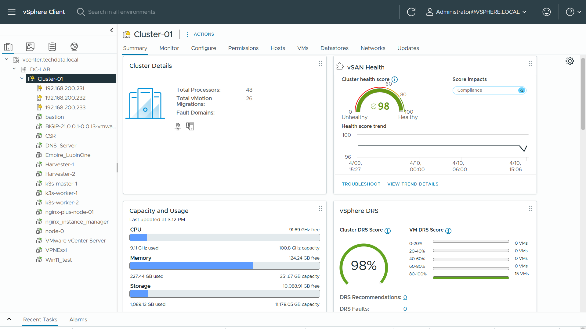
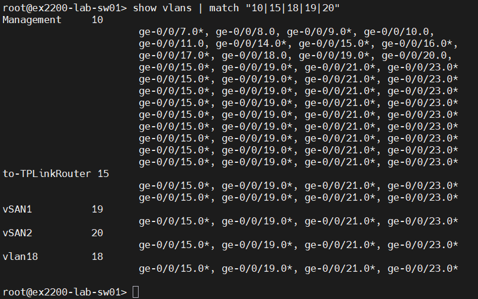
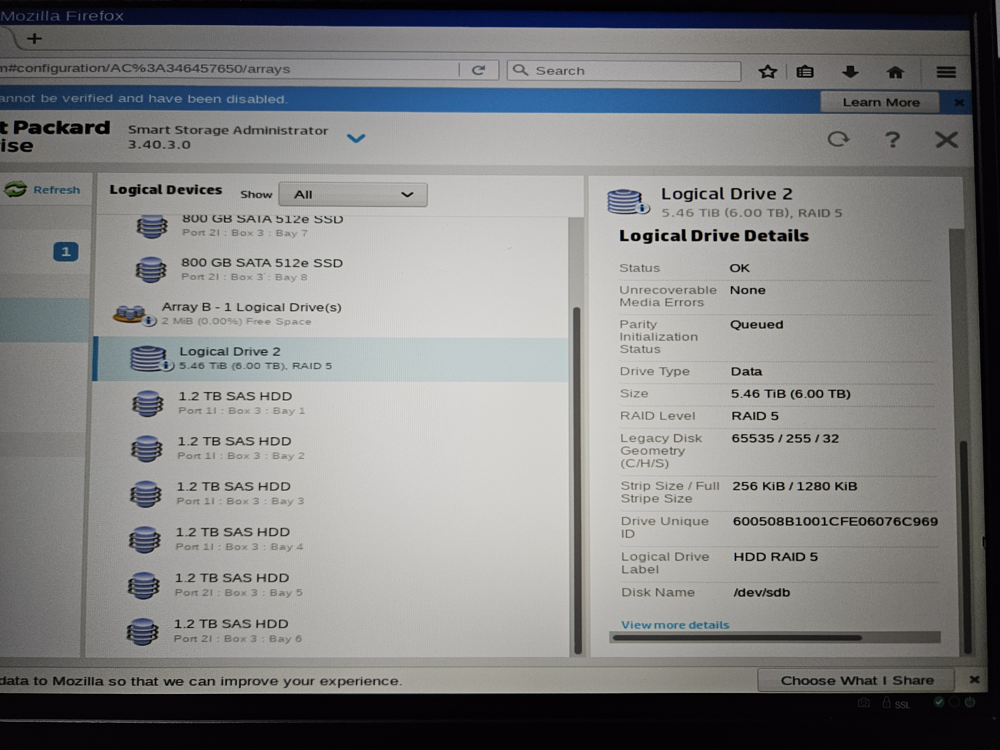
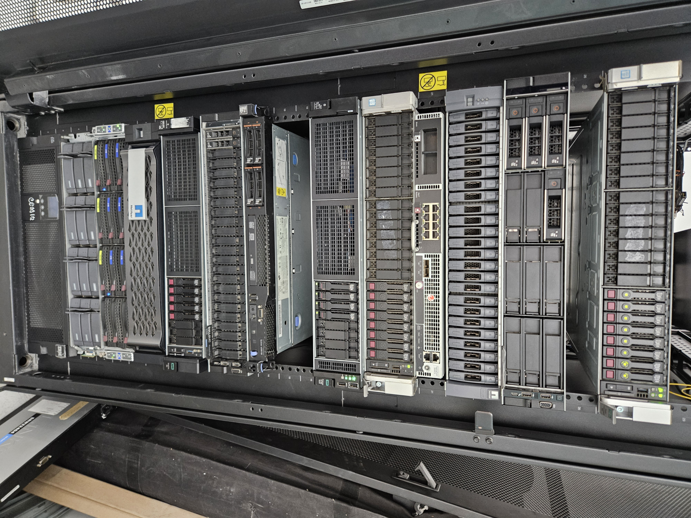
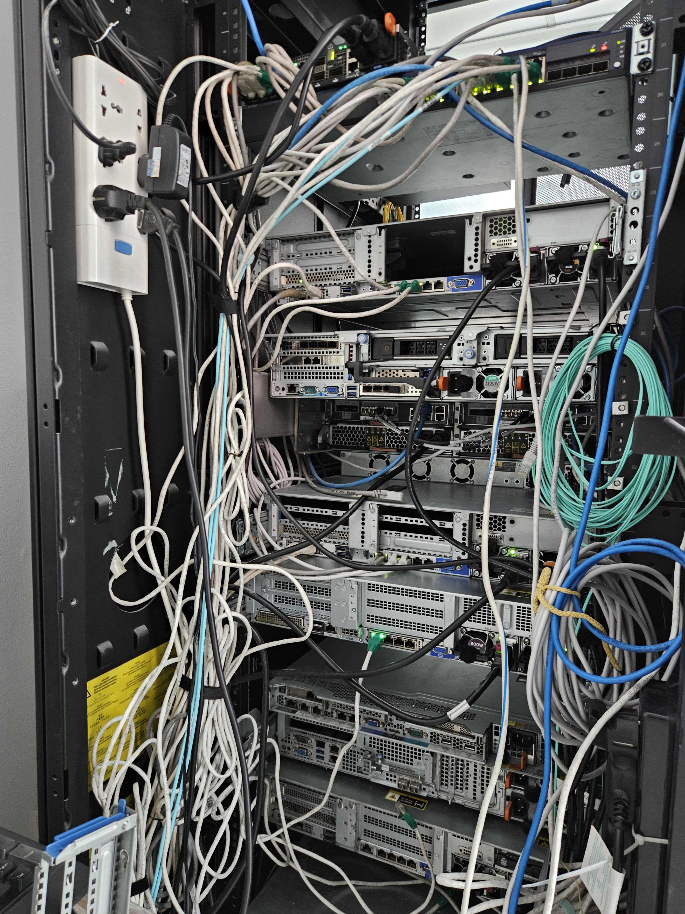

# Enterprise Hybrid-Cloud Infrastructure & Nutanix-VMware Implementation

## Project Overview
Deployed a production-grade 3-node Hyper-Converged Infrastructure (HCI) during my internship at **Tech Data APAC**. This project demonstrates the integration of **VMware ESXi 8.0.3 on Nutanix NX hardware**, professional networking with **Juniper switches**, and advanced hardware lifecycle management across multiple generations.

---

## Tech Stack
| Category | Component |
| :--- | :--- |
| **HCI Hardware** | Nutanix NX-Series Appliances |
| **Hypervisor** | **VMware ESXi 8.0.3** (Managed via vCenter) |
| **Networking** | Juniper EX-Series Switch (Junos OS) |
| **Server Lifecycle**| **HPE ProLiant Gen9, Gen10 & Gen11** |
| **Modern Ops** | Kubernetes (K8s), F5 MCP, Claude AI (AIOps) |

---

## Key Achievements

### 1. Hybrid Virtualization: VMware on Nutanix
Successfully implemented a hybrid environment by installing **VMware ESXi 8.0.3 directly on Nutanix NX hardware**.
* **Architecture:** Leveraged Nutanix Controller VMs (CVMs) to provision robust, distributed NFS datastores.
* **Management:** Full integration with vCenter for High Availability (HA) and vMotion (running on Management network).

### 2. Network Segmentation (Juniper Junos OS)
Designed and executed a resilient network schema on a **Juniper EX-series switch**. Verified configuration via Junos CLI using `match` filters to isolate specific lab traffic.

**Logical Network Schema:**
| VLAN ID | Name | Purpose |
| :--- | :--- | :--- |
| **10** | Management | ESXi Management & vMotion traffic |
| **15** | Public/Internet | Outbound traffic via TP-Link Router |
| **18** | VM_Workloads | Dedicated network for User Virtual Machines |
| **19 / 20**| vSAN_Dual | Redundant paths for high-availability vSAN storage sync |

### 3. Hardware Lifecycle & Recovery (HPE Gen9/10/11)
Managed hardware deployment and troubleshooting for HPE ProLiant servers, including the latest **Gen11** units.
* **Challenge:** Encountered a **Corrupted BIOS** on an HPE Gen9 unit, blocking standard RAID configuration tools.
* **Solution:** Leveraged **HPE Smart Storage Administrator (SSA) Offline** via bootable media to bypass faulty firmware.
* **Outcome:** Successfully provisioned RAID arrays and prepared logical drives for ESXi installation.

### 4. Physical Infrastructure (Real-World Setup)
Performed full hardware tasks, from physical racking to cabling and labeling in the data center environment.

| Front View | Rear View |
| :---: | :---: |
|  |  |

---

## 📩 Contact Info
* **LinkedIn:** www.linkedin.com/in/ducduy8315
